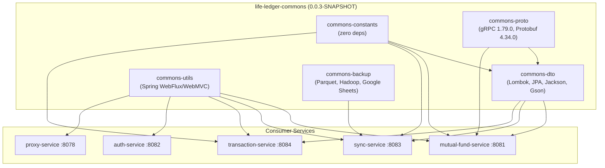
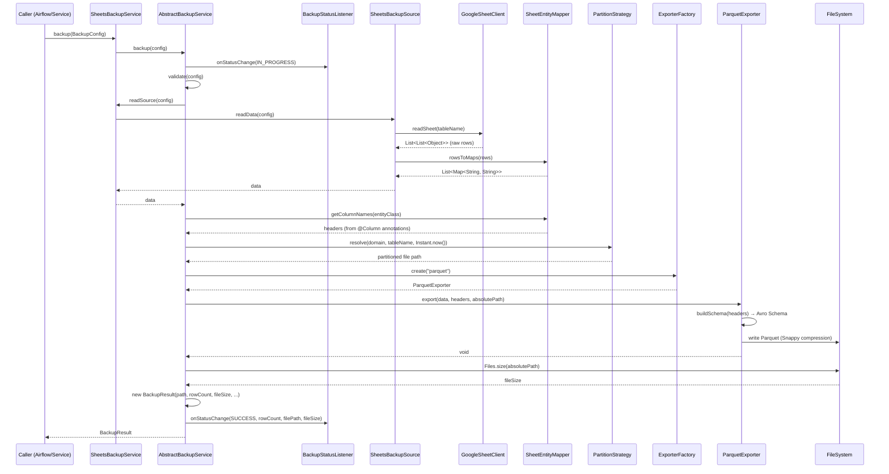
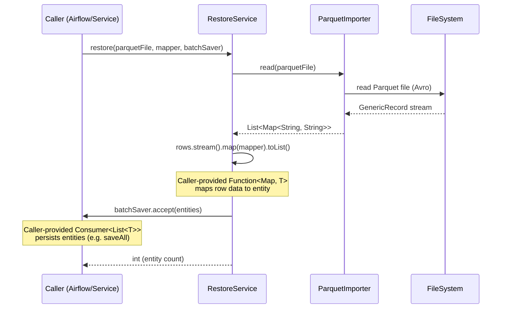
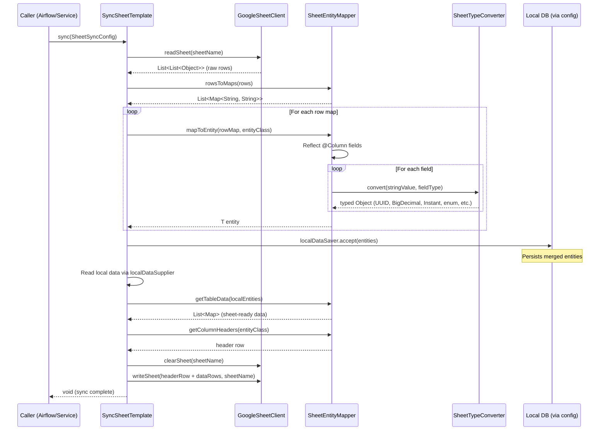
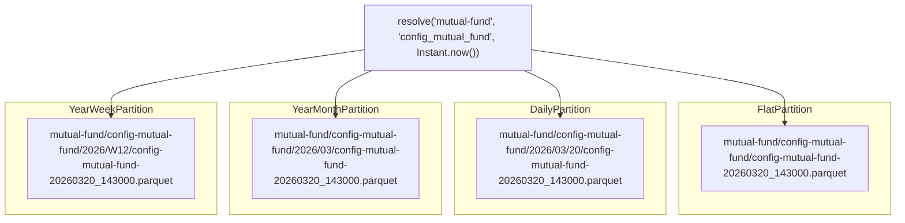
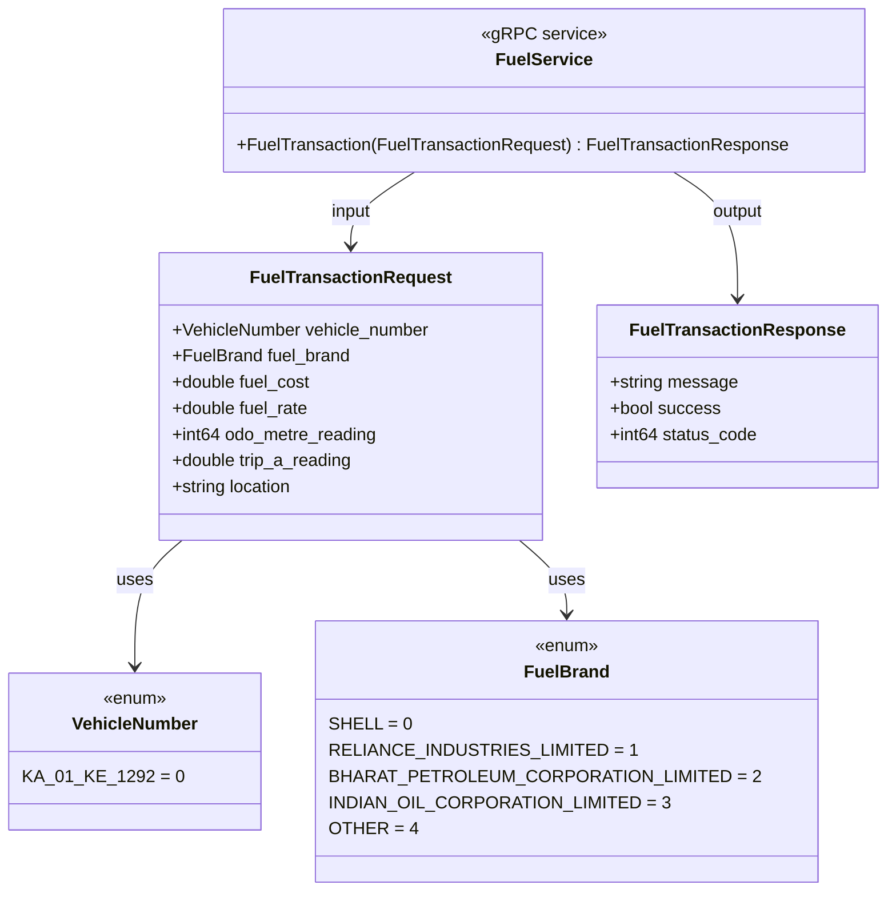
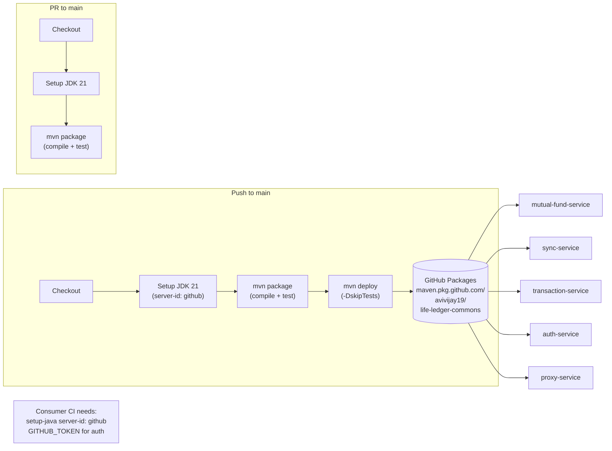

# Low-Level Design — Life Ledger Commons

## 1. Module Dependency Diagram



## 2. Package Structure

```
com.github.avivijay19.lifeledger.commons
├── constants/                        # [constants module]
│   ├── DatabaseConstants
│   ├── FuelConstants
│   ├── MutualFundConstants
│   ├── SheetsConstants
│   └── TransactionConstants
├── enumeration/                      # [constants module]
│   ├── backup/
│   │   ├── GithubBackupStatus
│   │   ├── GithubBranchStatus
│   │   └── GithubPrStatus
│   ├── mutualFund/
│   │   ├── InvestmentStatus
│   │   ├── SipStatus
│   │   └── InvestmentSource
│   ├── sheets/
│   │   └── SheetTitle
│   ├── transaction/
│   │   ├── TransactionStatus
│   │   └── VerificationStatus
│   └── utils/
│       └── DateTime
├── regex/                            # [constants module]
│   └── RegexConstants
├── dto/                              # [dto module]
│   ├── fuel/
│   │   ├── FuelRecordRequest
│   │   ├── PeriodFuelRecord
│   │   ├── PeriodFuelRecordResponse
│   │   └── SectionalPeriodRecord
│   ├── mf/
│   │   ├── bulk/request/
│   │   │   ├── BulkCurrentMutualFund
│   │   │   └── BulkResponse
│   │   ├── current/{request,response}/
│   │   │   ├── CurrentMutualFundRequestMap
│   │   │   └── CurrentMutualFundResponse
│   │   ├── invested/request/
│   │   │   ├── InvestedMutualFund
│   │   │   └── InvestedMutualFundRequestMap
│   │   ├── investedHistory/request/
│   │   │   ├── InvestedHistoryMutualFundRequest
│   │   │   └── MarkCompleteRequest
│   │   ├── mfapi/
│   │   │   ├── Data, MFApi, Meta
│   │   ├── pending/request/
│   │   │   ├── PendingInvestmentRequest
│   │   │   └── PendingInvestmentMarkStatusRequest
│   │   └── sip/{request,response}/
│   │       ├── SipRequest
│   │       └── SipResponse
│   ├── sheets/
│   │   └── SheetUpdateRequest
│   └── transaction/
│       └── Transactions
├── embeddedId/                       # [dto module]
│   ├── FuelSerializer
│   └── mutualfund/
│       ├── CurrentMutualFundSerializer
│       ├── InvestedSerializer
│       ├── InvestedHistorySerializer
│       └── SipSerializer
├── entity/                           # [dto module]
│   ├── AuditableEntity (abstract base)
│   ├── mutualfund/
│   │   ├── ConfigMutualFund
│   │   ├── CurrentMutualFund
│   │   ├── InvestedMutualFund
│   │   ├── InvestedHistoryMutualFund
│   │   ├── SipMutualFund
│   │   └── PendingInvestment
│   ├── transactions/
│   │   ├── Transaction
│   │   └── TransactionCategory
│   └── vehicle/
│       └── Fuel
├── utils/                            # [utils module]
│   └── config/
│       ├── ApplicationConfig
│       └── CorsConfig
└── backup/                           # [backup module]
    ├── config/
    │   └── BackupConfig
    ├── export/
    │   ├── Exporter (interface)
    │   ├── ExporterFactory
    │   ├── ParquetExporter
    │   └── ParquetImporter
    ├── model/
    │   └── BackupResult
    ├── partition/
    │   ├── PartitionStrategy (interface)
    │   ├── FlatPartition
    │   ├── DailyPartition
    │   ├── YearMonthPartition
    │   └── YearWeekPartition
    ├── service/
    │   ├── AbstractBackupService (template)
    │   ├── SheetsBackupService
    │   └── RestoreService
    ├── sheets/
    │   ├── GoogleSheetClient
    │   ├── SheetEntityMapper
    │   ├── SheetTypeConverter
    │   ├── SyncSheetTemplate
    │   └── SheetSyncConfig
    ├── source/
    │   ├── BackupSource (interface)
    │   └── SheetsBackupSource
    └── status/
        ├── BackupStatus (enum)
        ├── BackupStatusEvent (record)
        └── BackupStatusListener (interface)

com.github.avivijay19.fuel            # [proto module — generated]
├── FuelServiceGrpc
├── FuelTransactionRequest
├── FuelTransactionResponse
├── VehicleNumber (enum)
└── FuelBrand (enum)
```

## 3. Entity Hierarchy Diagram

```mermaid
classDiagram
    class AuditableEntity {
        <<abstract>>
        <<@MappedSuperclass>>
        #Instant auditCreateTimestamp
        #Instant auditUpdateTimestamp
    }

    class ConfigMutualFund {
        +Long id
        +String schemeName
        +String schemeCode
        +String amcName
        +String category
    }

    class CurrentMutualFund {
        +EmbeddedId id
        +Double nav
        +Double units
        +Double investedAmount
        +Double currentValue
    }

    class InvestedMutualFund {
        +EmbeddedId id
        +Double nav
        +Double units
        +Double amount
        +InvestmentStatus status
        +InvestmentSource source
    }

    class InvestedHistoryMutualFund {
        +EmbeddedId id
        +Double nav
        +Double units
        +Double amount
    }

    class SipMutualFund {
        +EmbeddedId id
        +Double amount
        +Integer sipDate
        +SipStatus status
    }

    class PendingInvestment {
        +Long id
        +String schemeName
        +Double amount
        +InvestmentStatus status
    }

    class Transaction {
        +Long id
        +String description
        +Double amount
        +TransactionStatus status
        +VerificationStatus verificationStatus
    }

    class TransactionCategory {
        +Long id
        +String name
        +String type
    }

    class Fuel {
        +EmbeddedId id
        +Double fuelCost
        +Double fuelRate
        +Long odoMetreReading
        +Double tripAReading
        +String location
    }

    AuditableEntity <|-- ConfigMutualFund
    AuditableEntity <|-- CurrentMutualFund
    AuditableEntity <|-- InvestedMutualFund
    AuditableEntity <|-- InvestedHistoryMutualFund
    AuditableEntity <|-- SipMutualFund
    AuditableEntity <|-- PendingInvestment
    AuditableEntity <|-- Transaction
    AuditableEntity <|-- TransactionCategory
    AuditableEntity <|-- Fuel
```



## 4. Backup Module — Class Diagram

```mermaid
classDiagram
    class BackupConfig {
        -PartitionStrategy partitionStrategy
        -Path outputDir
        -String tableName
        -String domain
        -String triggeredBy
        -Class~?~ entityClass
        -List~BackupStatusListener~ listeners
        +builder() Builder
        +getPartitionStrategy() PartitionStrategy
        +getOutputDir() Path
        +getTableName() String
        +getDomain() String
        +getTriggeredBy() String
        +getEntityClass() Class~?~
        +getListeners() List
    }

    class BackupConfig_Builder {
        +partitionStrategy(PartitionStrategy) Builder
        +outputDir(Path) Builder
        +tableName(String) Builder
        +domain(String) Builder
        +triggeredBy(String) Builder
        +entityClass(Class~?~) Builder
        +addListener(BackupStatusListener) Builder
        +build() BackupConfig
    }

    class Exporter {
        <<interface>>
        +export(List~Map~ data, List~String~ headers, Path filePath) void
    }

    class ExporterFactory {
        +create(String format)$ Exporter
    }

    class ParquetExporter {
        +export(List~Map~ data, List~String~ headers, Path filePath) void
        -buildSchema(List~String~ headers) Schema
        -sanitizeFieldName(String name)$ String
    }

    class ParquetImporter {
        +read(Path filePath) List~Map~
        +getRowCount(Path filePath) int
    }

    class PartitionStrategy {
        <<interface>>
        +resolve(String domain, String tableName, Instant backupTime) Path
    }

    class FlatPartition {
        +resolve(String, String, Instant) Path
    }

    class DailyPartition {
        +resolve(String, String, Instant) Path
    }

    class YearMonthPartition {
        +resolve(String, String, Instant) Path
    }

    class YearWeekPartition {
        +resolve(String, String, Instant) Path
    }

    class AbstractBackupService {
        <<abstract>>
        +backup(BackupConfig config) BackupResult
        #readSource(BackupConfig config)* List~Map~
        #validate(BackupConfig config) void
        -resolveHeaders(BackupConfig, List~Map~) List~String~
        -resolvePartition(BackupConfig) Path
        -notifyListeners(BackupConfig, BackupStatusEvent) void
    }

    class SheetsBackupService {
        -BackupSource source
        #readSource(BackupConfig config) List~Map~
    }

    class RestoreService {
        -ParquetImporter importer
        +restore(Path file, Function mapper, Consumer batchSaver) int
    }

    class BackupSource {
        <<interface>>
        +readData(BackupConfig config) List~Map~
    }

    class SheetsBackupSource {
        -GoogleSheetClient sheetClient
        +readData(BackupConfig config) List~Map~
    }

    class GoogleSheetClient {
        -String base64Credentials
        -String spreadsheetId
        +readSheet(String sheetName) List~List~Object~~
        +writeSheet(List~List~Object~~ data, String sheetName) void
        +clearSheet(String sheetName) void
        -createWorksheet(Sheets service, String sheetName) void
        -getSheetsService() Sheets
    }

    class SheetEntityMapper {
        +getColumnNames(Class~?~ entityClass)$ List~String~
        +getColumnHeaders(Class~?~ entityClass)$ List~Object~
        +getTableData(List~T~ entities)$ List~Map~
        +rowsToMaps(List~List~Object~~ rows)$ List~Map~
        +mapToEntity(Map~String_String~ row, Class~T~ entityClass)$ T
        -toRow(T entity)$ Map~String_String~
    }

    class SheetTypeConverter {
        +convert(String value, Class~?~ targetType)$ Object
        +convertEnum(String value, Class~?~ enumType)$ Object
    }

    class SyncSheetTemplate {
        -GoogleSheetClient sheetClient
        +sync(SheetSyncConfig~T~ config) void
        -readRemoteData(SheetSyncConfig~T~) List~Map~
        -writeLocalToSheet(SheetSyncConfig~T~) void
        -mergeAndSync(SheetSyncConfig~T~, List~Map~) void
    }

    class SheetSyncConfig~T~ {
        -String sheetName
        -Class~T~ entityClass
        -Supplier~List~T~~ localDataSupplier
        -Consumer~List~T~~ localDataSaver
        +builder() Builder
        +getSheetName() String
        +getEntityClass() Class~T~
        +getLocalDataSupplier() Supplier
        +getLocalDataSaver() Consumer
    }

    class BackupResult {
        <<record>>
        +String filePath
        +int rowCount
        +long fileSizeBytes
        +String tableName
        +String domain
        +Instant timestamp
    }

    class BackupStatus {
        <<enum>>
        IN_PROGRESS
        SUCCESS
        FAILED
    }

    class BackupStatusEvent {
        <<record>>
        +BackupStatus status
        +String tableName
        +int rowCount
        +String filePath
        +long fileSizeBytes
        +String errorMessage
        +String triggeredBy
        +Instant timestamp
        +inProgress(String, String)$ BackupStatusEvent
        +success(String, int, String, long, String)$ BackupStatusEvent
        +failed(String, String, String)$ BackupStatusEvent
    }

    class BackupStatusListener {
        <<interface>>
        +onStatusChange(BackupStatusEvent event) void
    }

    BackupConfig --> BackupConfig_Builder : creates
    BackupConfig --> PartitionStrategy : uses
    BackupConfig --> BackupStatusListener : notifies

    Exporter <|.. ParquetExporter
    ExporterFactory ..> Exporter : creates

    PartitionStrategy <|.. FlatPartition
    PartitionStrategy <|.. DailyPartition
    PartitionStrategy <|.. YearMonthPartition
    PartitionStrategy <|.. YearWeekPartition

    AbstractBackupService --> BackupConfig : uses
    AbstractBackupService --> ExporterFactory : creates exporter
    AbstractBackupService --> SheetEntityMapper : resolves headers
    AbstractBackupService --> BackupResult : returns
    AbstractBackupService --> BackupStatusEvent : emits

    SheetsBackupService --|> AbstractBackupService
    SheetsBackupService --> BackupSource : reads from

    BackupSource <|.. SheetsBackupSource
    SheetsBackupSource --> GoogleSheetClient : reads sheets
    SheetsBackupSource --> SheetEntityMapper : maps rows

    RestoreService --> ParquetImporter : reads Parquet

    SyncSheetTemplate --> GoogleSheetClient : reads/writes sheets
    SyncSheetTemplate --> SheetSyncConfig : configured by
    SyncSheetTemplate --> SheetEntityMapper : maps entities
    SheetEntityMapper --> SheetTypeConverter : converts field types
```



## 5. Backup Workflow — Sequence Diagram



## 6. Restore Workflow — Sequence Diagram



## 7. Sheets Sync Framework — Sequence Diagram



### SheetTypeConverter — Supported Types

| Target Type | Conversion Logic |
|---|---|
| `String` | Passthrough |
| `UUID` | `UUID.fromString(value)` |
| `BigDecimal` | `new BigDecimal(value)` |
| `Long` / `long` | `Long.parseLong(value)` |
| `Integer` / `int` | `Integer.parseInt(value)` |
| `Double` / `double` | `Double.parseDouble(value)` |
| `Boolean` / `boolean` | `Boolean.parseBoolean(value)` |
| `Instant` | ISO-8601 parsing |
| `LocalDate` | ISO date parsing |
| `LocalDateTime` | ISO date-time parsing |
| Enum types | `Enum.valueOf(enumClass, value)` |

### SheetSyncConfig — Builder Fields

| Field | Type | Purpose |
|---|---|---|
| `sheetName` | `String` | Google Sheets tab name to sync with |
| `entityClass` | `Class<T>` | JPA entity class for reflection-based mapping |
| `localDataSupplier` | `Supplier<List<T>>` | Reads current local DB state (e.g., `repository::findAll`) |
| `localDataSaver` | `Consumer<List<T>>` | Persists merged entities (e.g., `repository::saveAll`) |

## 8. Partition Strategy — Output Paths



All partitions use `Asia/Kolkata` timezone and format timestamps as `yyyyMMdd_HHmmss`. Table names are lowercased with underscores replaced by hyphens.

## 9. gRPC Proto Service Diagram



## 10. Publishing Pipeline



## 11. Design Patterns

| Pattern | Usage | Class |
|---|---|---|
| Template Method | `backup()` defines the algorithm; subclasses implement `readSource()` | `AbstractBackupService` |
| Builder | Immutable config construction with required/optional fields | `BackupConfig.Builder` |
| Factory | Creates exporters by format string | `ExporterFactory` |
| Strategy | Pluggable file partitioning (Flat, Daily, YearMonth, YearWeek) | `PartitionStrategy` |
| Observer | Status listeners notified on backup progress | `BackupStatusListener` |
| Adapter | Maps Google Sheets raw data to `List<Map<String, String>>` | `SheetsBackupSource` |
| Mapper | Reflects JPA `@Column` annotations to extract headers/data and map back to entities | `SheetEntityMapper` |
| Type Converter | Coerces string values to Java types (UUID, BigDecimal, dates, enums) | `SheetTypeConverter` |
| Template | Orchestrates bidirectional sync: read remote, merge, write back | `SyncSheetTemplate` |
| Builder | Configures sync parameters: sheet name, entity class, data suppliers | `SheetSyncConfig` |

## 12. Testing

### Backup Module Tests (9 classes)

| Test Class | Tests | Covers |
|---|---|---|
| `BackupConfigTest` | Builder validation, required fields (`partitionStrategy`, `outputDir`, `tableName`, `domain`), default `triggeredBy` |
| `ExporterFactoryTest` | Factory returns `ParquetExporter` for `"parquet"`, throws for unknown format |
| `ParquetRoundTripTest` | Write data to Parquet with Snappy, read back, verify data integrity and row count |
| `PartitionStrategyTest` | All 4 strategies produce correct directory hierarchy and file names |
| `RestoreServiceTest` | Read Parquet, map to entities via `Function`, batch save via `Consumer` |
| `SheetEntityMapperTest` | `@Column` annotation reflection, `rowsToMaps` with headers/data, empty input handling |
| `SheetTypeConverterTest` | String-to-Java type coercion for UUID, BigDecimal, dates, enums |
| `SheetEntityMapperMapToEntityTest` | Reflection-based Map-to-entity conversion via @Column |
| `SyncSheetTemplateTest` | Bidirectional sync orchestrator with mocked GoogleSheetClient |

### Test Structure
```
life-ledger-commons-backup/src/test/java/
└── com/github/avivijay19/lifeledger/commons/backup/
    ├── config/
    │   └── BackupConfigTest
    ├── export/
    │   ├── ExporterFactoryTest
    │   └── ParquetRoundTripTest
    ├── partition/
    │   └── PartitionStrategyTest
    ├── service/
    │   └── RestoreServiceTest
    └── sheets/
        ├── SheetEntityMapperTest
        ├── SheetTypeConverterTest
        ├── SheetEntityMapperMapToEntityTest
        └── SyncSheetTemplateTest
```
